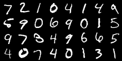
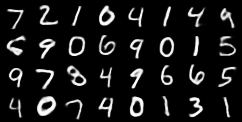

# What is Autoencoder ?

Autoencoders are an unsupervised learning technique in which we leverage neural networks for the task of representation learning. Specifically, we'll design a neural network architecture such that we impose a bottleneck in the network which forces a compressed knowledge representation of the original input. If the input features were each independent of one another, this compression and subsequent reconstruction would be a very difficult task. However, if some sort of structure exists in the data (ie. correlations between input features), this structure can be learned and consequently leveraged when forcing the input through the network's bottleneck.

# Variational Autoencoder

When we regularize an autoencoder so that its latent representation is not overfitted to a single data point but the entire data distribution, we can perform random sampling from the latent space and hence generate unseen images from the distribution, making our autoencoder ‘variational’.

# Network Architecture

It comprises an encoder, decoder, with the latent representation reparameterized in between.

* Encoder — The encoder consists of two convolutional layers, followed by two separated fully-connected layer that both takes the convoluted feature map as input. The two full-connected layers output two vectors in the dimension of our intended latent space, with one of them being the mean and the other being the variance. This is the main structural difference between VAEs and traditional autoencoders.

* Reparameterization — With mean and variance computed, we randomly sample a point that is likely to happen with our given distribution, and this point would be used as the latent representation to be fed into the decoding stage.

* Decoder — The decoder is similar to the traditional autoencoders, with one fully-connected layer followed by two convolutional layers to reconstruct the image based on the given latent representation.

# Loss Function

One of the core concepts of the VAE is its loss function designed. In simple words, we are trying to design the loss such that it reconstructs well based on the given images, but also pertains the entire distribution and not overfit to only the image itself. Thus, the VAE loss is the combination of :

**Binary Cross Entropy (BCE) Loss** — This calculates the pixel-to-pixel difference of the reconstructed image with the original image to maximise the similarity of reconstruction. BCE Loss is calculated as the following:

**KL-Divergence Loss** — KL divergence measures the similarity of two distributions. In this case, we assume the distribution to be normal, and hence the loss is designed as the following:

# Results

**Input**

**Output**

